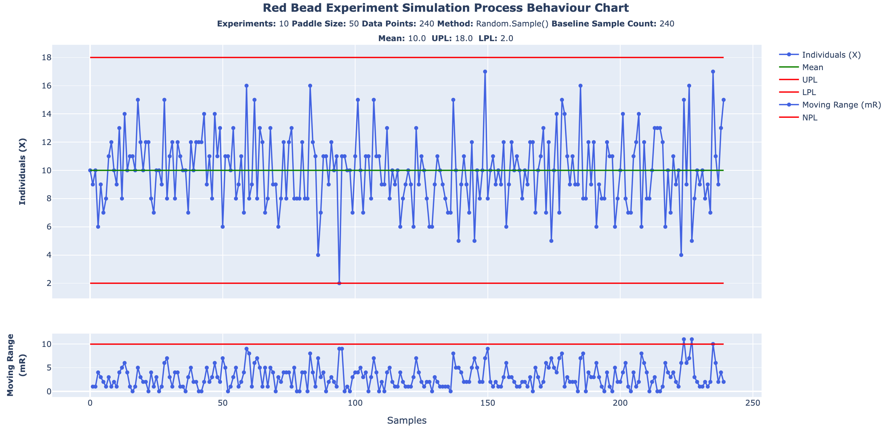
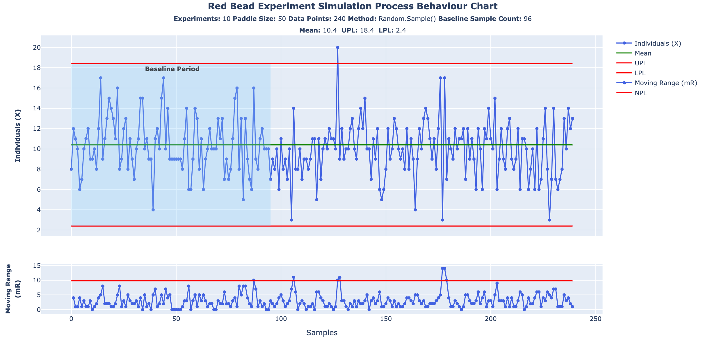

# Red Bead Experiment Simulator

A simulation of Dr. W.E. Deming's Red Bead experiment using random sampling to test his assertion that there is a difference between mechanical and random sampling, and that there is no rational basis to equate the two for purposes of **prediction**. In his words, _"Statistical theory (theory of probability) as taught in the books for the theory of sampling and theory of distributions applies in the use of random numbers, but not in experiences of life."_

## Background

In _Out of the Crisis (1986)_, Dr. Deming debriefs readers on the results of a typical run of his Red Bead experiment, and asks the reader (as he did in his seminars) what they would believe the cumulative average of red beads would be if they carried on into the future:

>**Cumulated average.** Question : As 20 per cent of the beads in the box are red, what do you think would be the cumulated average, the statistical limit, as we continue to produce lots by the same process over many days?
> 
>The answer that comes forth spontaneously from the audience is that it must be 10 because 10 is 20 per cent of 50, the size of a lot. Wrong. 
>
>We have no basis for such a statement. As a matter of fact, the cumulated average for paddle No. 2 over many experiments in the past has settled down to 9.4 red beads per lot of 50. Paddle No. 1, used for 30 years, shows an average of 11.3. 
>
>The paddle is an important piece of information about the process. Would the reader have thought so prior to these figures?
>
>_Deming, W. Edwards. Out of the Crisis (MIT Press) (pp. 351-352). The MIT Press. Kindle Edition._

He then proposes a method for testing his assertion:
>**Sampling by use of random numbers.** If we were to form lots by use of random numbers, then the cumulated average, the statistical limit of x-BAR, would be 10. The reason is that the random numbers pay no attention to color, nor to size, nor to any other physical characteristic of beads, paddle, or employee. _Statistical theory (theory of probability) as taught in the books for the theory of sampling and theory of distributions applies in the use of random numbers, but not in experiences of life._ Once statistical control is established, then a distribution exists, and is predictable.
>
>_Deming, W. Edwards. Out of the Crisis (MIT Press) (p. 353). The MIT Press. Kindle Edition._

## Aim

The aim of this simulation is to replicate Dr. Deming's proposed method for random sampling using Python code to observe the cumulative average of red beads over successive runs. The drawing of "random lots" will be replicated using randomly-populated arrays from which samples are "drawn".

## Results

Below are the results generated by the simulation, replicating ten cycles of fifteen iterations of the Red Bead Experiment, for purposes of capturing a large number of samples for calculating the cumulative average. The column of numbers represents the cumulative average captured from each of the fifteen corresponding iterations.

````
10.202777777777778
10.027777777777779
10.341666666666667
10.075
10.275
10.35
10.305555555555555
10.2
10.219444444444445
10.261111111111111

Red Bead Experiment Cycles: 15
Samples Withdrawn per Experiment Cycle: 24
Cumulative Average Cycles: 10
Total Randomly-Drawn Sample Lots: 3600
Overall Cumulative Average: 10.225833333333334
````

## Example Output

Here are some sample charts the simulation can generate: the first is what I call a "standard" run using the default settings without providing any options, the second demonstrates using `--baselinePeriod 96` option to highlight a custom baseline period to calculate the limits against.




## Observations

As Dr. Deming postulated, drawing of lots using random numbers does yield a cumulative average of 10 red beads. For comparison, pictured below is a capture of 360 hand-sampled lots using a [3-D printed paddle](https://www.thingiverse.com/thing:3991096) modeled after the same one Deming used in his demonstrations of the Red Bead Experiment. Note the cumulative average of 9.69


## Discussion

Why is the cumulative average for the manually-drawn samples not aligning with those of the simulation? As Deming himself suggested, there is more to the exercise than randomly drawing beads: It is a system and systems exhibit _variation_ through the interaction of their parts. In the case of the experiement, the paddle's interaction with the beads in the bucket, and the beads between themselves don't guarantee a uniform distribution for sampling. What's drawn with each sample depends on where the paddle is inserted, and how it is moved to ensure beads fall into each indentation. The beads themselves are _imperfect_ with some having burrs on them that were not removed after molding, or were not formed correctly - all of which can and do affect the samples that are drawn.


## Installation

To use this program, you need to have Python installed on your system. You can install the required dependencies using `pip`.

```bash
pip install -r requirements.txt
````

## Usage
````
python ReadBeadSim.py [OPTIONS]
````

### Options
- **`--experimentCycles <int>`**: How many Red Bead Experiments to run; defaults to 10
- **`--cumulativeAvgCycles <int>`**: How many master cycles to run experiments within; defaults to 1
- **`--customSampleMethod`**: Flag to use my own method to draw samples; omit to default to Random.Sample()
- **`--baselineSamplePeriod <int>`**: How many samples to calculate avg and limits against; defaults to ALL (-1) if omitted
- **`--paddleLotSize <int>`**: How many beads to sample per turn; defaults to 50 for the classic experiment

### Example
````
python RedBeadSim.py --experimentCycles 15 --baselineSamplePeriod 96 --paddleLotSize 60
````

## License

This project is licensed under the MIT License - see the [LICENSE](LICENSE) file for details.

