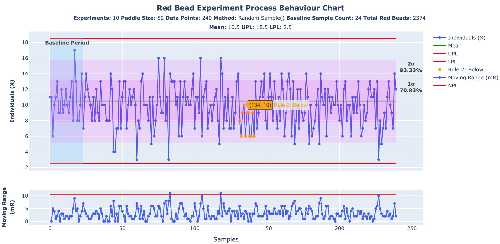
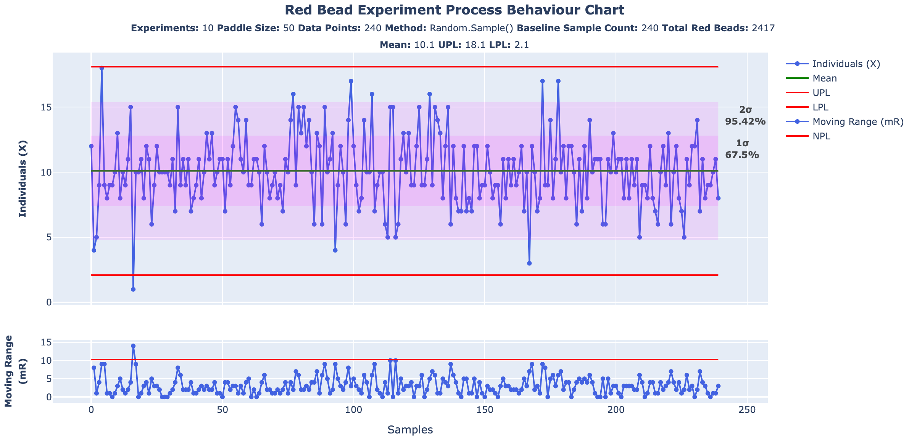
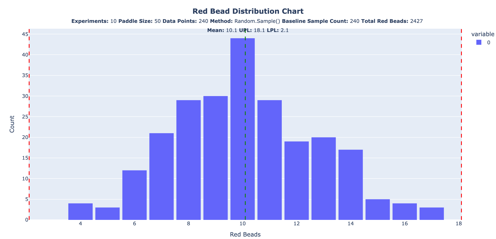
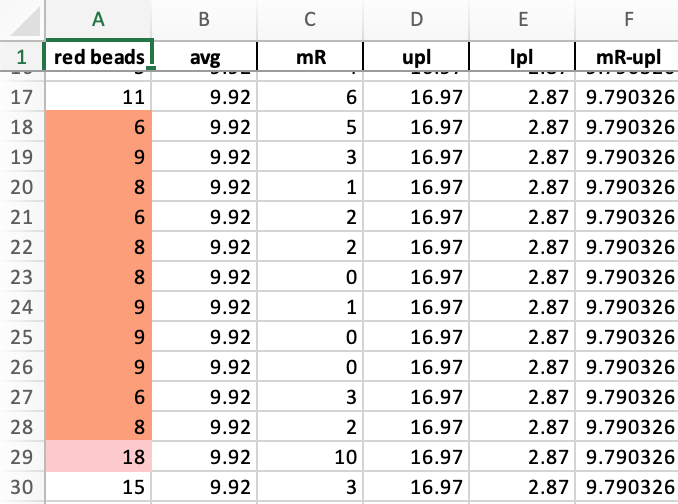

# The Great Red Bead Experiment Simulator

A simulation of Dr. W.E. Deming's Red Bead experiment using random sampling to test his assertion that there is a difference between mechanical and random sampling, and that there is no rational basis to equate the two for purposes of **prediction**. In his words, _"Statistical theory (theory of probability) as taught in the books for the theory of sampling and theory of distributions applies in the use of random numbers, but not in experiences of life."_

## Background

In _Out of the Crisis (1986)_, Dr. Deming debriefs readers on the results of a typical run of his Red Bead experiment, and asks the reader (as he did in his seminars) what they would believe the cumulative average of red beads would be if they carried on into the future:

>**Cumulated average.** Question : As 20 per cent of the beads in the box are red, what do you think would be the cumulated average, the statistical limit, as we continue to produce lots by the same process over many days?
> 
>The answer that comes forth spontaneously from the audience is that it must be 10 because 10 is 20 per cent of 50, the size of a lot. **_Wrong_**. 
>
>**We have no basis for such a statement.** As a matter of fact, the cumulated average for paddle No. 2 over many experiments in the past has settled down to 9.4 red beads per lot of 50. Paddle No. 1, used for 30 years, shows an average of 11.3. 
>
>_The paddle is an important piece of information about the process. Would the reader have thought so prior to these figures?_
>
>_Deming, W. Edwards. Out of the Crisis (MIT Press) (pp. 351-352). The MIT Press. Kindle Edition._

He then proposes a method for testing his assertion:
>**Sampling by use of random numbers.** If we were to form lots by use of random numbers, then the cumulated average, the statistical limit of x-BAR, would be 10. The reason is that the random numbers pay no attention to color, nor to size, nor to any other physical characteristic of beads, paddle, or employee. _Statistical theory (theory of probability) as taught in the books for the theory of sampling and theory of distributions applies in the use of random numbers, but not in experiences of life._ Once statistical control is established, then a distribution exists, and is predictable.
>
>_Deming, W. Edwards. Out of the Crisis (MIT Press) (p. 353). The MIT Press. Kindle Edition._

## Aim

The aim of this simulation is to replicate Dr. Deming's proposed method for random sampling using Python code to observe the cumulative average of red beads over successive runs. The drawing of "random lots" will be replicated using randomly-populated arrays from which samples are "drawn".

## Assumptions

To replicate the experiment, the simulation assumes the standard configuration of Dr. Deming's Red Bead Experiment, ie. six willing workers who will draw one sample of 50 beads from a bucket containing an 80/20 mix of white to red beads (usually 3,200 white, 800 red) over four simulated days. For the purposes of the simulation, the rating/ranking/dismissal on Day 3 isn't required, we just presume the six willing workers keep drawing until Day 4.

## Results

Below are the results generated by the simulation, replicating ten cycles of fifteen iterations of the Red Bead Experiment, for purposes of capturing a large number of samples for calculating the cumulative average. The column of numbers represents the cumulative average captured from each of the fifteen corresponding iterations.

````
10.202777777777778
10.027777777777779
10.341666666666667
10.075
10.275
10.35
10.305555555555555
10.2
10.219444444444445
10.261111111111111

Red Bead Experiment Cycles: 15
Samples Withdrawn per Experiment Cycle: 24
Cumulative Average Cycles: 10
Total Randomly-Drawn Sample Lots: 3600
Overall Cumulative Average: 10.225833333333334
````

## Example Output

Here are some sample charts the simulation can generate: the first is what I call a "standard" run using the default settings without providing any options, the second demonstrates using `--baselineSamplePeriod` option to highlight a custom baseline period for calculating the limits against the first 96 data points in the series.


### Rolling Baseline Period

This was created using the ````--loadFromExcel```` option to re-plot previously-saved results and changing the ````--baselineSamplePeriod```` over several iterations. Note how the Rule 2 signals disappear and re-appear as the sample changes. Also observe how the data points captured in the 1σ and 2σ bands solidify beyond the first 24 points and remain un-changed as the baseline sample period extends to the entire range.


## Observations

As Dr. Deming postulated, drawing of lots using random numbers does yield a cumulative average of 10 red beads. For comparison, pictured below is a capture of 360 hand-sampled lots using a [3-D printed paddle](https://www.thingiverse.com/thing:3991096) modeled after the same one Deming used in his demonstrations of the Red Bead Experiment. Note the cumulative average of 9.69


## Discussion

Why is the cumulative average for the manually-drawn samples not aligning with those of the simulation? As Deming himself suggested, there is more to the exercise than randomly drawing beads: It is a system and systems exhibit _variation_ through the interaction of their parts. In the case of the experiment, the paddle's interaction with the beads in the bucket, and the beads between themselves don't guarantee a uniform distribution for sampling. What's drawn with each sample depends on where the paddle is inserted, and how it is moved to ensure beads fall into each indentation. The beads themselves are _imperfect_ with some having burrs on them that were not removed after molding, or were not formed correctly - all of which can and do affect the samples that are drawn.


## See Also

For deeper-dives into understanding the **Red Bead Experiment** and how **Process Behaviour Charts** work, check out the following posts from my newsletter, **The Digestible Deming**:

- [The Parable of the Red Beads](https://digestibledeming.substack.com/p/the-parable-of-the-red-beads)
- [Red Bead Redux](https://digestibledeming.substack.com/p/red-bead-redux)
- [Enumerative vs. Analytic Studies](https://digestibledeming.substack.com/p/enumerative-versus-analytic-studies)
- [Control Charts](https://digestibledeming.substack.com/p/control-charts)
- [A Rational Basis for Prediction](https://digestibledeming.substack.com/p/a-rational-basis-for-prediction)
- [Understanding How Process Behaviour Charts Work](https://digestibledeming.substack.com/p/understanding-how-process-behaviour)


## New Features

### Load from Excel

Previously-saved experiment data can now be loaded using the ````--loadFromExcel```` option while preserving the ability to layer-in changing the options for visual aids like the Baseline Sample Period and Sigma Unit bands. The data can be in any Excel file as long as it is in the first column in "Sheet 1" under the header "red beads".

### Display Total Red Beads

The chart header now includes a total count of red beads drawn across the entire run of simulated experiments.


### Highlight Rule 2 Signals

By default, the "X" or Individuals chart now shows data points that meet the criteria for a "Rule 2 Signal", ie. eight or more consecutive points above or below the mean.



### Visual Aids for Sigma Units of Dispersion

Use the ````--showSigmaUnitHighlights```` option with 1, 2, or 3 to add corresponding visual aids that capture the data points in sigma units of dispersion bands around the mean, along with percentages. This helps to better understand ["The Empirical Rule"](https://digestibledeming.substack.com/i/137149558/empirical-rule) behind how Process Behaviour Charts work and why 3σ was chosen to avoid false special-cause signals.

**NB:** _This feature can be paired with the ````--baselineSamplePeriod```` option._



### Red Beads Distribution Histogram

Use the ````--showDistribution```` option to generate a distribution chart in addition to the Process Behaviour Chart for a simulation. The chart includes visual aids for the process limits and mean.



### Export Results to Excel

Use the ````--exportToExcel```` option to capture simulation results in an Excel workbook. The data has been arranged into columns that can be easily used to generate an XmR chart.

**NEW!** Red bead cells are now highlighted to show Rule 1 (red) and Rule 2 (orange) signals.



## Installation

Download and install Python for your system:

- [Python Releases for Windows](https://www.python.org/downloads/windows/)
- [Python Releases for macOS](https://www.python.org/downloads/macos/)

### For Linux:

```bash
sudo apt update
sudo apt install python3
```


1. **Clone the repository** (if you haven't already):

   ```bash
   git clone https://github.com/DerailleurAgile/red-bead-sim.git
   cd red-bead-sim
   ```

2. **Install the dependencies**

   ```bash
   pip install -r requirements.txt
   ```
 
## Usage
````
python ReadBeadSim.py [OPTIONS]
````

### Options
- **`--experimentCycles <int>`**: How many Red Bead Experiments to run; defaults to 10
- **`--cumulativeAvgCycles <int>`**: How many master cycles to run experiments within; defaults to 1
- **`--customSampleMethod`**: Flag to use my own method to draw samples; omit to default to Random.Sample()
- **`--baselineSamplePeriod <int>`**: How many samples to calculate avg and limits against; defaults to ALL (-1) if omitted
- **`--paddleLotSize <int>`**: How many beads to sample per turn; defaults to 50 for the classic experiment
- **`--beads <int> <int>`**: How many white and red beads to simulate sampling from; defaults to 3200 800 for the classic experiment
- **`--showSigmaUnitHighlights <int>`**: Show visual aids for 1, 2, or 3 sigma units of dispersion around the mean; defaults to 0
- **`--showDistribution`**: Flag to show red beads in another browser tab as a distribution histogram with process limits 
- **`--exportToExcel`**: Flag to export results to an Excel workbook in the execution folder
- **`--loadFromExcel <str>`**: Load a previously-exported Red Bead Experiment Excel file
- **`--showDegreesOfFreedom`**: Flag to show graph of uncertainty in limits

### Example
````
python RedBeadSim.py --experimentCycles 15 --baselineSamplePeriod 96 --paddleLotSize 25
python RedBeadSim.py --exportToExcel
python RedBeadSim.py --loadFromExcel redbeadsim-20240808234004.xlsx --showSigmaUnitHighlights 2
python RedBeadSim.py --beads 3000 750 --baselineSamplePeriod 24 --showDistribution
````

## License

This project is licensed under the MIT License - see the [LICENSE](LICENSE) file for details.

